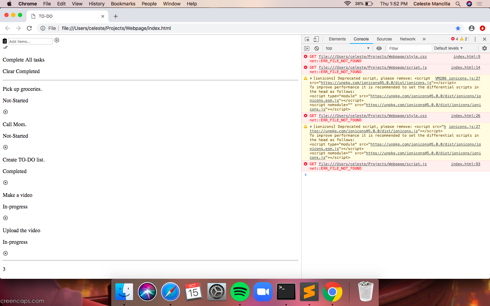

 Last week, Kajari went on a vacation and she left us with a task. The task was to create a simple to do list through Sublime Text. We had to read an article and copy some things from that article to sublime text. [This is the article we used](https://blog.usejournal.com/ create-a-to-do-list-application-with-html-css-and-pure-js-533e1b07c20e). We were working on the task and this is what it looked like on chrome, because we created a file in a project called “WebPage” which allowed us to open up the link where we worked on. 

  

We also learned a few commands and a few things about Html and Css. The commands that we reviewed were commands which are to save, command z which is to undo something,and take us back. Lastly, command r which is to reload so we can check if it is right. About 2 weeks ago we reviewed Html, this week we talked about Css. Css basically allows you to add things to your page to make it look prettier, while Html is a markup language for the words and only the words. We also talked about Javascript, which makes it dynamic and it allows you to make buttons to do more things, it is the glue that keeps everything.

